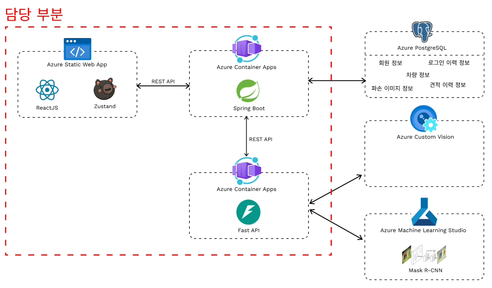
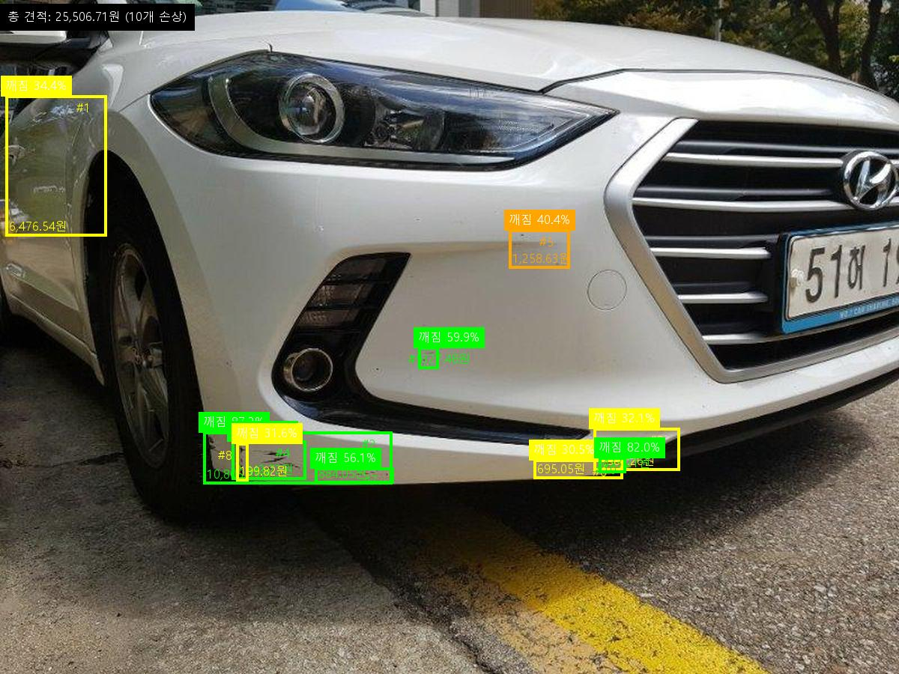
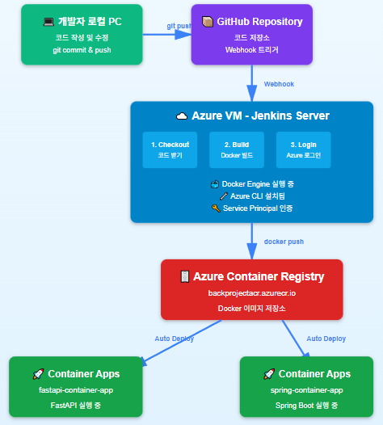

<p align="center">  
  
</p>

<h1 align="center">SNAP-Q Backend Server</h1>

<p align="center">
  <strong>차량 파손 부위 판별 및 수리비 예측 시스템 - Spring Boot 백엔드</strong>
</p>

<p align="center">
  
  
  
  
  
  
</p>

---

## 1. 프로젝트 개요

### 소개

**SNAP-Q Backend Server**는 차량 파손 이미지를 기반으로 수리비를 예측하는 SNAP-Q 시스템의 Spring Boot 백엔드 서버입니다.

사용자 인증, 차량 관리, 견적 요청 처리, FastAPI AI 엔진과의 연동 등 시스템의 핵심 비즈니스 로직을 담당하며, React 프론트엔드와 FastAPI AI 엔진 사이의 중앙 서버 역할을 수행합니다.

### SNAP-Q 전체 시스템에서의 역할

이 프로젝트는 SNAP-Q 전체 시스템의 **비즈니스 로직 및 데이터 관리** 부분을 담당합니다.

React 프론트엔드에서 사용자가 파손 이미지를 업로드하면, 본 Spring Boot 서버가 이미지 메타데이터를 PostgreSQL에 저장한 뒤, FastAPI AI 엔진으로 이미지 정보를 전달합니다. AI 엔진이 Azure Custom Vision과 Mask R-CNN을 통해 파손 분석 및 수리비를 예측하여 응답하면, 결과를 데이터베이스에 저장하고 React 프론트엔드에 견적 결과를 반환합니다.

> **FastAPI AI Engine 프로젝트**: [snapQ-fastapi](https://github.com/jaehyeon0420/snapQ-fastapi)

### 목차

1. [프로젝트 개요](#1-프로젝트-개요)
2. [주요 기능](#2-주요-기능)
3. [시스템 아키텍처](#3-시스템-아키텍처)
4. [워크플로우](#4-워크플로우)
5. [결과](#5-결과)
6. [기술 스택](#6-기술-스택)
7. [프로젝트 구조](#7-프로젝트-구조)
8. [API 엔드포인트](#8-api-엔드포인트)
9. [인프라 및 배포](#9-인프라-및-배포)
10. [환경 설정 및 실행 방법](#10-환경-설정-및-실행-방법)

---

## 2. 주요 기능

| 기능 | 설명 |
|------|------|
| **회원 관리** | 회원가입, 로그인, 정보 수정, 비밀번호 변경, 회원 탈퇴 |
| **JWT 인증** | Access Token / Refresh Token 기반 인증 및 AOP를 통한 자동 토큰 검증 |
| **차량 관리** | 차량 등록, 목록 조회 (페이징 지원) |
| **견적 요청** | 파손 이미지 업로드 후 FastAPI AI 엔진으로 분석 요청 및 결과 저장 |
| **견적 이력 조회** | 과거 견적 결과를 페이징으로 조회 |
| **견적서 이메일 발송** | 견적 결과를 PDF로 생성하여 이메일 전송 |

### 인증 흐름

```
로그인 요청 → 비밀번호 검증 (BCrypt)
    └─ Access Token 발급 (5분)
    └─ Refresh Token 발급 (14일)
        └─ API 요청 시 AOP에서 Access Token 자동 검증
            └─ 만료 시 Refresh Token으로 재발급
```

---

## 3. 시스템 아키텍처

<p align="center">
  
</p>

**처리 흐름**

1. ReactJS 프론트엔드에서 파손 이미지 업로드
2. Spring Boot가 이미지 메타데이터를 PostgreSQL에 저장
3. Spring Boot가 FastAPI로 이미지 전달 (REST API)
4. Azure Custom Vision으로 파손 유형 분류
5. Mask R-CNN으로 파손 영역 탐지
6. 두 모델의 결과를 결합하여 수리비 견적 산출
7. 분석 결과(견적 JSON + 시각화 이미지)를 Spring Boot에 응답
8. Spring Boot가 견적 결과를 PostgreSQL에 저장
9. ReactJS 프론트엔드에 결과 출력

---

## 4. 워크플로우

<p align="center">
  
</p>

```
[React 프론트엔드]
    │
    ├─ 회원가입 / 로그인 요청
    │   └─ Spring Boot → PostgreSQL 회원 정보 저장 / 조회
    │       └─ JWT 토큰 발급 → React에 응답
    │
    ├─ 차량 등록 / 조회 요청
    │   └─ Spring Boot → PostgreSQL 차량 정보 관리
    │
    └─ 파손 이미지 업로드 (견적 요청)
        └─ Spring Boot
            ├─ 이미지 파일 저장 + 메타데이터 DB 등록
            ├─ FastAPI AI 엔진으로 이미지 전달
            │   ├─ [Model 1] Azure Custom Vision → 파손 유형 분류
            │   └─ [Model 2] Mask R-CNN → 파손 영역 탐지
            │       └─ 수리비 견적 산출 → ZIP 응답 (JSON + 시각화 이미지)
            ├─ 견적 결과 DB 저장
            └─ React에 결과 응답
```

---

## 5. 결과

### 파손 영역 탐지 결과 이미지

분석된 이미지에 바운딩 박스, 파손 유형, 신뢰도, 비용 정보가 시각화됩니다.

<p align="center">
  
</p>

- 신뢰도 50% 이상: 🟢 초록 / 40~50%: 🟠 주황 / 30~40%: 🟡 노랑 / 30% 이하: 🔴 빨강
- 각 바운딩 박스에 파손 유형, 신뢰도, 추천 수리비 표시
- 이미지 상단에 총 견적 금액 표시

### 수리비 견적 보고서

사용자는 견적 결과를 PDF 형태로 다운로드하거나 이메일로 전송받을 수 있습니다.

<p align="center">
  
</p>

---

## 6. 기술 스택

| 분류 | 기술 |
|------|------|
| **Framework** | Spring Boot 3.4.2 |
| **Language** | Java 17 |
| **ORM** | MyBatis 3.0.4 |
| **Database** | Azure PostgreSQL |
| **인증** | JWT (jjwt 0.12.6), Spring Security (BCrypt) |
| **이메일** | Spring Boot Starter Mail (SMTP) |
| **AOP** | Spring Boot Starter AOP |
| **빌드 도구** | Maven |
| **컨테이너** | Docker |
| **CI/CD** | Jenkins |
| **인프라** | Azure Container Apps, Azure Container Registry |

---

## 7. 프로젝트 구조

```
springproject/
├── pom.xml                                          # Maven 의존성 관리
├── Dockerfile                                       # Docker 컨테이너 설정
├── Jenkinsfile                                      # Jenkins CI/CD 파이프라인
│
└── src/main/
    ├── java/com/academy/msai/
    │   ├── SpringprojectApplication.java            # 애플리케이션 진입점
    │   │
    │   ├── common/                                  # 공통 모듈
    │   │   ├── annotation/
    │   │   │   └── NoTokenCheck.java                # JWT 검증 제외 어노테이션
    │   │   ├── aop/
    │   │   │   └── ValidateAOP.java                 # AOP 기반 JWT 토큰 검증
    │   │   ├── config/
    │   │   │   └── WebConfig.java                   # CORS 및 정적 리소스 설정
    │   │   ├── exception/
    │   │   │   ├── CommonException.java             # 커스텀 예외 클래스
    │   │   │   └── CommonExceptionHandler.java      # 전역 예외 핸들러
    │   │   ├── filter/
    │   │   │   └── EncodingFilter.java              # 인코딩 필터
    │   │   ├── model/dto/
    │   │   │   ├── FastApiRes.java                  # FastAPI 응답 모델
    │   │   │   ├── PageInfo.java                    # 페이징 정보
    │   │   │   └── ResponseDTO.java                 # 공통 응답 DTO
    │   │   └── util/
    │   │       ├── FileUtils.java                   # 파일 업로드 유틸리티
    │   │       ├── JwtUtils.java                    # JWT 생성/검증 유틸리티
    │   │       └── PageUtil.java                    # 페이징 유틸리티
    │   │
    │   ├── member/                                  # 회원 도메인
    │   │   ├── controller/
    │   │   │   └── MemberController.java            # 회원 API 컨트롤러
    │   │   └── model/
    │   │       ├── dao/
    │   │       │   └── MemberDao.java               # 회원 MyBatis Mapper
    │   │       ├── dto/
    │   │       │   ├── LoginMember.java              # 로그인 응답 DTO
    │   │       │   └── Member.java                  # 회원 DTO
    │   │       └── service/
    │   │           └── MemberService.java           # 회원 비즈니스 로직
    │   │
    │   └── mycar/                                   # 차량/견적 도메인
    │       ├── controller/
    │       │   └── MycarController.java             # 차량/견적 API 컨트롤러
    │       └── model/
    │           ├── dao/
    │           │   └── MycarDao.java                # 차량/견적 MyBatis Mapper
    │           ├── dto/
    │           │   ├── BrokenFile.java              # 파손 이미지 파일 DTO
    │           │   ├── Car.java                     # 차량 DTO
    │           │   └── EstiMate.java                # 견적 이력 DTO
    │           └── service/
    │               └── MycarService.java            # 차량/견적 비즈니스 로직
    │
    └── resources/
        ├── application.properties                   # 애플리케이션 설정
        └── mapper/
            ├── car-mapper.xml                       # 차량/견적 SQL 매퍼
            └── member-mapper.xml                    # 회원 SQL 매퍼
```

---

## 8. API 엔드포인트

### 회원 API (`/members`)

| 메서드 | 경로 | 설명 | 인증 |
|--------|------|------|------|
| `POST` | `/members` | 회원가입 (차량 정보 포함) | ❌ |
| `GET` | `/members/{memberId}/id-check` | 아이디 중복 체크 | ❌ |
| `POST` | `/members/login` | 로그인 (JWT 토큰 발급) | ❌ |
| `POST` | `/members/refresh` | Access Token 재발급 | ✅ |
| `GET` | `/members/{memberId}` | 마이페이지 조회 | ✅ |
| `PATCH` | `/members` | 회원 정보 수정 | ✅ |
| `POST` | `/members/auth/password-check` | 기존 비밀번호 확인 | ✅ |
| `PATCH` | `/members/password` | 비밀번호 변경 | ✅ |
| `DELETE` | `/members/{memberId}` | 회원 탈퇴 | ✅ |

### 차량/견적 API (`/mycar`)

| 메서드 | 경로 | 설명 | 인증 |
|--------|------|------|------|
| `GET` | `/mycar` | 내 차량 목록 조회 (페이징) | ✅ |
| `GET` | `/mycar/all` | 내 차량 목록 전체 조회 | ✅ |
| `POST` | `/mycar` | 견적 요청 (파손 이미지 업로드 → FastAPI 연동) | ✅ |
| `POST` | `/mycar/send-email` | 견적서 이메일 전송 | ✅ |
| `GET` | `/mycar/estimate` | 견적 이력 조회 (페이징) | ✅ |

### 견적 요청 상세

**`POST /mycar`**

| 파라미터 | 타입 | 설명 |
|---------|------|------|
| `carId` | `String` | 차량 ID |
| `brokenFiles` | `MultipartFile[]` | 파손 이미지 파일 목록 (multipart/form-data) |

**처리 과정**

1. 파손 이미지 파일 저장 및 메타데이터 DB 등록
2. FastAPI AI 엔진으로 이미지 전달 (`POST /mycar/estimate`)
3. AI 분석 결과(ZIP) 수신 및 파싱
4. 견적 결과 DB 저장
5. 분석 결과를 클라이언트에 응답

---

## 9. 인프라 및 배포

<p align="center">
  
</p>

### CI/CD 파이프라인

Jenkins를 통해 자동화된 빌드 및 배포 파이프라인이 구성되어 있습니다.

```
GitHub Push → Jenkins Pipeline
  ├─ Cleanup Workspace
  ├─ Checkout Code (master branch)
  ├─ Maven Build (mvn clean package -DskipTests)
  ├─ Build Docker Image
  └─ Login to Azure & Push to ACR
       └─ Azure Container Registry (backprojectacr.azurecr.io)
            └─ Azure Container Apps 자동 배포
```

### 배포 환경

| 항목 | 설정 |
|------|------|
| **컨테이너 레지스트리** | Azure Container Registry (`backprojectacr.azurecr.io`) |
| **컨테이너 런타임** | Azure Container Apps |
| **베이스 이미지** | `eclipse-temurin:17-jdk-alpine` |
| **포트** | 8080 |
| **인증** | Azure Service Principal |

---

## 10. 환경 설정 및 실행 방법

### 사전 요구 사항

- Java 17+
- Maven 3.6+
- PostgreSQL 데이터베이스 (Azure PostgreSQL 또는 로컬)
- FastAPI AI 엔진 실행 중 ([snapQ-fastapi](https://github.com/jaehyeon0420/snapQ-fastapi))

### 환경 변수 설정

`src/main/resources/application.properties` 파일을 환경에 맞게 수정합니다.

```properties
# 서버 설정
server.address=0.0.0.0
server.port=9999

# 데이터베이스 설정
spring.datasource.driver-class-name=org.postgresql.Driver
spring.datasource.url=jdbc:postgresql://<DB_HOST>:5432/<DB_NAME>?sslmode=require
spring.datasource.username=<DB_USERNAME>
spring.datasource.password=<DB_PASSWORD>

# JWT 설정
jwt.secret-key=<JWT_SECRET_KEY>
jwt.expire-minute=5
jwt.expire-hour-refresh=336

# 파일 업로드 경로
file.uploadPath=<FILE_UPLOAD_PATH>

# FastAPI 엔드포인트
fastapi.endpoint=http://127.0.0.1:8000

# 이메일 설정 (SMTP)
spring.mail.host=smtp.naver.com
spring.mail.port=587
spring.mail.username=<EMAIL_ADDRESS>
spring.mail.password=<EMAIL_PASSWORD>
```

### 로컬 실행

```bash
# 1. 프로젝트 빌드
mvn clean package -DskipTests

# 2. 애플리케이션 실행
java -jar target/springproject-0.0.1-SNAPSHOT.jar

# 또는 Maven으로 직접 실행
mvn spring-boot:run
```

### Docker 실행

```bash
# 1. 프로젝트 빌드
mvn clean package -DskipTests

# 2. Docker 이미지 빌드
docker build -t snap-q-backend .

# 3. 컨테이너 실행
docker run -d \
  --name snap-q-backend \
  -p 8080:8080 \
  snap-q-backend
```
